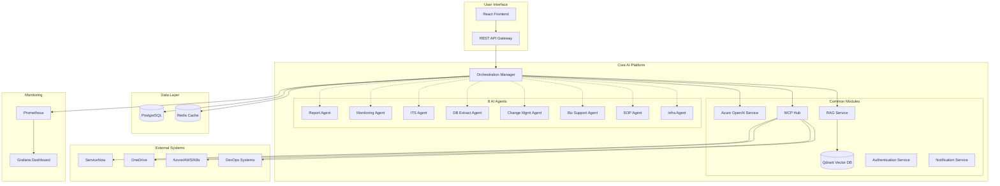
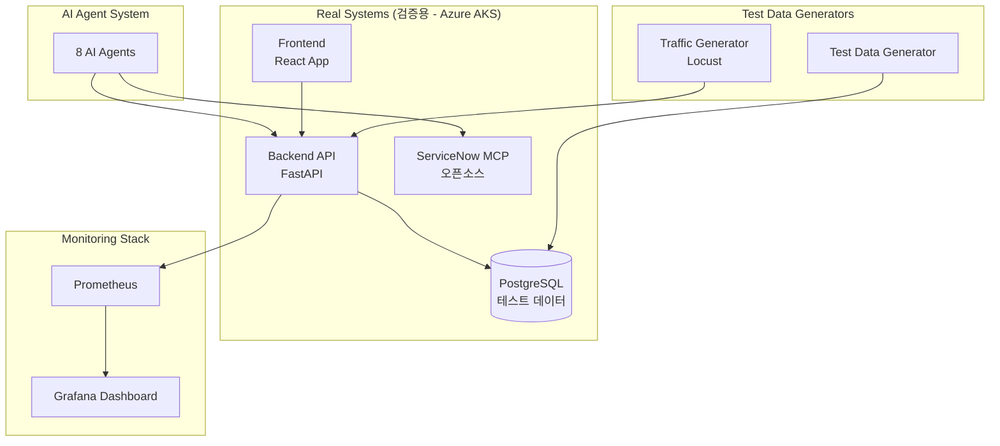

# Agentic AI 시스템 개발 명세서

## 1. Executive Summary

본 문서는 8개의 AI Agent를 포함한 제조 AI Platform 구축을 위한 개발 명세 및 계획을 정의합니다.

### 1.1 프로젝트 개요
- **목적**: 운영 자동화를 위한 Multi-Agent AI 시스템 구축
- **범위**: 8개 AI Agent (Report, Monitoring, ITS, DB Extract, Change Management, Biz Support, SOP, Infra)
- **기본 LLM**: Azure OpenAI
- **예상 기간**: 16주 (4개월)

---

## 2. 기술 스택 선정

### 2.1 Crew AI vs Dify 비교 분석

#### Crew AI (선정)
**장점:**
- ✅ **Multi-agent orchestration 강력**: Role-based agent 정의 및 협업 지원
- ✅ **유연한 커스터마이징**: Python 기반으로 복잡한 로직 구현 용이
- ✅ **LangChain 통합**: 풍부한 Tool 및 MCP 통합 지원
- ✅ **Agent 간 Task delegation**: Change Management Agent가 다른 Agent 호출 가능
- ✅ **확장성**: 새로운 Agent 추가 및 Tool 개발 용이

**단점:**
- ❌ UI/UX 제한적
- ❌ 운영 모니터링 도구 부족

#### Dify (미채택)
**장점:**
- ✅ Low-code/No-code 플랫폼
- ✅ 우수한 UI/UX
- ✅ RAG 구축 간편
- ✅ 내장 모니터링 기능

**단점:**
- ❌ **Multi-agent orchestration 약함**: 8개 Agent 협업 구현 어려움
- ❌ 복잡한 워크플로우 제한
- ❌ 커스터마이징 제약

#### 선정 근거
```
1. 8개 Agent가 서로 협력하는 복잡한 시나리오 (예: Change Management → DevOps → Monitoring)
2. 각 Agent별 독립적인 역할 및 전문 Tool 필요
3. Python 기반 MCP/Tool 통합 요구사항
4. Azure OpenAI 통합 용이성
5. Dify의 단점(UI/모니터링)은 별도 Frontend + Grafana/Prometheus로 보완
```

### 2.2 전체 기술 스택

| 계층 | 기술 | 용도 |
|------|------|------|
| **AI Orchestration** | Crew AI | Multi-agent 관리 및 협업 |
| **LLM** | Azure OpenAI (GPT-4) | 자연어 이해 및 생성 |
| **Workflow** | LangGraph | Agent 워크플로우 시각화 및 관리 |
| **Framework** | LangChain | Tool 통합 및 Chain 구성 |
| **Vector DB** | Qdrant | RAG용 벡터 저장소 (고성능, 오픈소스) |
| **Embedding** | Azure OpenAI text-embedding-ada-002 | 문서 임베딩 |
| **MCP Server** | Custom MCP Servers | ServiceNow, DB, Cloud 등 외부 시스템 연동 |
| **Backend** | FastAPI | REST API 서버 |
| **Frontend** | React + TypeScript | 사용자 인터페이스 |
| **Database** | PostgreSQL | Agent 상태, 히스토리, 메타데이터 |
| **Message Queue** | Redis | Agent 간 비동기 통신 |
| **Monitoring** | Grafana + Prometheus | 시스템 모니터링 및 대시보드 |
| **Container** | Docker + Docker Compose | 로컬 개발 환경 |
| **CI/CD** | GitHub Actions | 자동화 빌드 및 배포 |

### 2.3 주요 라이브러리

```python
# Core AI
crewai==0.1.0
langchain==0.1.0
langgraph==0.0.20
openai==1.0.0

# Vector DB
qdrant-client==1.7.0

# Backend
fastapi==0.109.0
uvicorn==0.27.0
pydantic==2.5.0
sqlalchemy==2.0.25

# MCP
mcp==0.1.0  # Custom MCP implementation

# Tools
python-dotenv==1.0.0
redis==5.0.1
psycopg2-binary==2.9.9

# Monitoring
prometheus-client==0.19.0
```

---

## 3. 시스템 아키텍처

### 3.1 전체 아키텍처



### 3.2 공통 기능 모듈 설계

#### 3.2.1 Core Services

```python
# src/core/services/llm_service.py
class AzureOpenAIService:
    """Azure OpenAI 통합 서비스 (공통)"""
    - chat_completion()
    - streaming_completion()
    - function_calling()
    - embedding_generation()

# src/core/services/rag_service.py
class RAGService:
    """RAG 서비스 (공통)"""
    - index_documents()
    - semantic_search()
    - retrieve_context()
    - update_knowledge_base()

# src/core/services/mcp_hub.py
class MCPHub:
    """MCP 통합 허브 (공통)"""
    - register_mcp_server()
    - call_tool()
    - list_available_tools()
    - health_check()

# src/core/services/auth_service.py
class AuthService:
    """인증/권한 관리 (공통)"""
    - authenticate_user()
    - authorize_action()
    - manage_api_keys()
    - system_credential_vault()
```

#### 3.2.2 Base Agent Class

```python
# src/core/base/base_agent.py
from abc import ABC, abstractmethod
from crewai import Agent, Task, Crew

class BaseAgent(ABC):
    """모든 Agent의 Base Class"""

    def __init__(self, name: str, role: str, goal: str):
        self.name = name
        self.role = role
        self.goal = goal
        self.llm_service = AzureOpenAIService()
        self.rag_service = RAGService()
        self.mcp_hub = MCPHub()
        self.auth_service = AuthService()

    @abstractmethod
    def get_tools(self) -> List[Tool]:
        """Agent별 Tool 정의"""
        pass

    @abstractmethod
    def execute_task(self, task: Dict) -> Dict:
        """Agent별 Task 실행 로직"""
        pass

    def _log_action(self, action: str, result: Any):
        """공통 로깅"""
        pass

    def _send_notification(self, channel: str, message: str):
        """공통 알림"""
        pass
```

#### 3.2.3 MCP Tool Wrappers

```python
# src/core/tools/mcp_tools.py
class MCPToolBase:
    """MCP Tool Base Class"""

class ServiceNowTool(MCPToolBase):
    """ServiceNow MCP Tool"""
    - create_incident()
    - update_incident()
    - get_incident_status()

class DatabaseTool(MCPToolBase):
    """Database MCP Tool"""
    - execute_query()
    - get_schema()
    - check_connection()

class OneDriveTool(MCPToolBase):
    """OneDrive MCP Tool"""
    - read_file()
    - write_file()
    - list_files()

class CloudProviderTool(MCPToolBase):
    """Cloud Provider (Azure/AWS) MCP Tool"""
    - scale_resource()
    - get_metrics()
    - deploy_service()
```

### 3.3 Agent별 상세 설계

#### Agent 1: Report Agent

```python
# src/agents/report_agent.py
class ReportAgent(BaseAgent):
    role = "Report Automation Specialist"
    goal = "자동으로 회의록, 보고서, 현황 조사를 작성"

    tools = [
        OneDriveTool(),
        FileReaderTool(),
        VoiceToTextTool(),
        DocumentGeneratorTool()
    ]

    workflow:
    1. 양식/템플릿 확인
    2. 데이터 소스 수집 (파일/Voice/RAG/DB)
    3. 필요 정보 확인 및 사용자 질의
    4. 보고서 작성
    5. 검토 요청 및 최종 저장
```

#### Agent 2: Monitoring Agent

```python
# src/agents/monitoring_agent.py
class MonitoringAgent(BaseAgent):
    role = "System Monitoring Specialist"
    goal = "서비스/App/DB 가용성 자동 모니터링"

    tools = [
        URLHealthCheckTool(),
        ServerAccessTool(),
        DatabaseConnectionTool(),
        LogAnalyzerTool()
    ]

    workflow:
    1. 점검 대상 목록 확인 (RAG에서 시스템 메타정보 조회)
    2. 각 점검 항목 실행 (URL/프로세스/DB/로그)
    3. 결과 분석 및 이상 탐지
    4. 요약 보고서 생성
    5. 이상 발생 시 SOP Agent 호출
```

#### Agent 3: ITS Agent

```python
# src/agents/its_agent.py
class ITSAgent(BaseAgent):
    role = "IT Service Management Specialist"
    goal = "ITS 요청/인시던트 자동 처리"

    tools = [
        ServiceNowTool(),
        CertificateManagerTool(),
        ConfigurationManagerTool()
    ]

    workflow:
    1. ITS 요청 접수 (자연어 이해)
    2. 구성정보 확인 및 현행화
    3. 관련 정보 사용자 입력 요청
    4. ServiceNow에 티켓 생성/업데이트
    5. 진행 상황 모니터링
    6. 완료 알림
```

#### Agent 4: DB Extract Agent

```python
# src/agents/db_extract_agent.py
class DBExtractAgent(BaseAgent):
    role = "Database Analysis Specialist"
    goal = "자연어 기반 DB 데이터 추출 및 분석"

    tools = [
        DatabaseTool(),
        SQLGeneratorTool(),
        DataValidatorTool()
    ]

    workflow:
    1. 시스템 DB 스키마 조회 (RAG)
    2. 자연어 → SQL 쿼리 생성
    3. 사용자 확인 후 쿼리 실행
    4. 결과 분석 및 정합성 검증
    5. 보고서 생성 (필요시 Report Agent 호출)
```

#### Agent 5: Change Management Agent

```python
# src/agents/change_mgmt_agent.py
class ChangeManagementAgent(BaseAgent):
    role = "Change Management Orchestrator"
    goal = "변경관리 프로세스 자동화 및 조율"

    tools = [
        ITSAgent(),  # Sub-agent 호출
        ReportAgent(),  # Sub-agent 호출
        DevOpsTool(),
        MonitoringAgent()  # Sub-agent 호출
    ]

    workflow:
    1. 변경 요청 분석
    2. 변경계획서 작성 (Report Agent 활용)
    3. 테스트 시나리오 생성
    4. 테스트 실행 및 결과 작성
    5. 동료평가/배포승인 요청 (ITS Agent 활용)
    6. DevOps 배포 실행
    7. 배포 후 점검 (Monitoring Agent 활용)
    8. 최종 보고서 작성
```

#### Agent 6: Biz Support Agent

```python
# src/agents/biz_support_agent.py
class BizSupportAgent(BaseAgent):
    role = "Business Support Specialist"
    goal = "사용자 문의 응대 및 기본 지원"

    tools = [
        RAGTool(),
        ITSAgent(),  # 필요시 티켓 생성
        KnowledgeBaseTool()
    ]

    workflow:
    1. 사용자 질문 이해
    2. RAG에서 관련 정보 검색
    3. 답변 생성 및 제공
    4. 추가 조치 필요시 ITS Agent 호출
    5. 해결 완료 확인
```

#### Agent 7: SOP Agent

```python
# src/agents/sop_agent.py
class SOPAgent(BaseAgent):
    role = "Standard Operating Procedure Specialist"
    goal = "장애 상황 판단 및 자동 조치"

    tools = [
        MonitoringAgent(),
        SOPKnowledgeBaseTool(),
        RemediationTool(),
        NotificationTool()
    ]

    workflow:
    1. Monitoring Agent 결과 확인
    2. 문제점 파악 및 유사 장애사례 검색 (RAG)
    3. SOP 기반 조치 가이드 생성
    4. 자동 조치 실행 (승인 후)
    5. 장애 전파 (Mail/SMS/Slack)
    6. 사후 보고서 작성
```

#### Agent 8: Infra Agent

```python
# src/agents/infra_agent.py
class InfraAgent(BaseAgent):
    role = "Infrastructure Management Specialist"
    goal = "인프라 성능 분석 및 자동 조정"

    tools = [
        CloudProviderTool(),
        DevOpsTool(),
        GitTool(),
        MonitoringAgent()
    ]

    workflow:
    1. 성능 데이터 수집 및 분석
    2. 리소스 조정 필요성 판단
    3. 조정 계획 수립 (CPU/MEM/Replica 등)
    4. 승인 후 배포 실행
    5. 배포 후 점검 (Monitoring Agent)
    6. 결과 보고
```

---

## 4. 유즈케이스 및 테스트 시나리오

### 4.1 유즈케이스 매트릭스

| Agent | 유즈케이스 ID | 시나리오 | 입력 | 출력 | 검증 방법 |
|-------|--------------|---------|------|------|----------|
| **Report** | UC-R-01 | 주간보고서 자동 작성 | 작업일지 파일들 | 주간보고서 MD | 보고서 완성도 평가 |
| | UC-R-02 | 회의록 자동 생성 | 회의 녹음 파일 | 회의록 문서 | 내용 정확도 검증 |
| | UC-R-03 | 현황 조사 취합 | 시스템 정보 파일들 | 현황 보고서 | 데이터 정합성 확인 |
| **Monitoring** | UC-M-01 | 서비스 Health Check | 시스템 목록 | 점검 결과 리포트 | 200 OK 응답 확인 |
| | UC-M-02 | DB 접속 및 데이터 검증 | DB 연결 정보 | 접속 상태 보고 | 쿼리 실행 성공 |
| | UC-M-03 | 로그 파일 이상 탐지 | 로그 경로 | 이상 로그 리스트 | 에러 로그 정확도 |
| | UC-M-04 | 스케줄 Job 실패 점검 | Job 목록 | 실패 Job 알림 | Job 상태 정확도 |
| **ITS** | UC-I-01 | 구성정보 현행화 | 변경 요청 | ServiceNow 티켓 | 티켓 생성 확인 |
| | UC-I-02 | SSL 인증서 발급 요청 | 도메인 정보 | 발급 요청서 | 요청서 완성도 |
| | UC-I-03 | 인시던트 자동 접수 | 장애 내용 | 인시던트 번호 | 티켓 내용 정확도 |
| **DB Extract** | UC-D-01 | 자연어 쿼리 생성 | "최근 주문 데이터 조회" | SQL + 결과 | SQL 정확도 |
| | UC-D-02 | 데이터 정합성 검증 | 테이블명 | 검증 리포트 | 정합성 규칙 통과 |
| | UC-D-03 | 복잡한 통계 쿼리 | "월별 매출 분석" | 분석 결과 | 결과 정확도 |
| **Change Mgmt** | UC-C-01 | 성능 개선 배포 (End-to-End) | "MEM/CPU 조정 후 배포" | 배포 완료 보고서 | 전체 프로세스 완료 |
| | UC-C-02 | 긴급 패치 배포 | 패치 정보 | 배포 체크리스트 | 체크리스트 완성도 |
| | UC-C-03 | 정기 변경 프로세스 | 변경 요청서 | 배포 완료 | 각 단계 검증 |
| **Biz Support** | UC-B-01 | 사용법 문의 응대 | "사용법 알려줘" | 상세 가이드 | 답변 정확도 |
| | UC-B-02 | 담당자 정보 조회 | "A system 담당자는?" | 담당자 정보 | 정보 정확도 |
| | UC-B-03 | 계정 발급 요청 | 사용자 정보 | ITS 티켓 | 티켓 생성 확인 |
| **SOP** | UC-S-01 | 장애 자동 감지 및 조치 | Monitoring 결과 | 조치 가이드 | 조치 적절성 |
| | UC-S-02 | 유사 장애 사례 검색 | 장애 증상 | 과거 사례 + 해결법 | 유사도 평가 |
| | UC-S-03 | 장애 전파 및 보고 | 장애 정보 | 알림 발송 | 알림 도달 확인 |
| **Infra** | UC-F-01 | 성능 분석 및 진단 | "A 시스템 성능 분석" | 분석 리포트 | 메트릭 정확도 |
| | UC-F-02 | Auto Scaling 실행 | "replica 조정" | 스케일링 완료 | 리소스 변경 확인 |
| | UC-F-03 | 패치 작업 자동화 | 패치 정보 | 패치 완료 보고 | 버전 확인 |

### 4.2 통합 시나리오 (E2E)

#### 시나리오 1: 성능 이슈 → 분석 → 배포 → 모니터링 (통합)

```
1. Monitoring Agent: CPU 사용률 90% 이상 감지
   ↓
2. SOP Agent: 장애 상황 판단, 이전 사례 검색
   ↓
3. Infra Agent: 성능 분석 수행, CPU/MEM 조정 계획 수립
   ↓
4. Change Management Agent: 변경 프로세스 시작
   - Report Agent: 변경계획서 작성
   - ITS Agent: 변경 승인 요청
   - DevOps Tool: 배포 실행
   - Monitoring Agent: 배포 후 점검
   ↓
5. Report Agent: 최종 보고서 작성
   ↓
6. Notification: 관련자에게 알림 발송
```

**검증 기준:**
- 각 Agent가 순차적으로 호출되는지 확인
- Agent 간 데이터 전달이 정확한지 검증
- 전체 프로세스 완료 시간 측정 (목표: 30분 이내)
- 최종 보고서에 모든 단계가 포함되어 있는지 확인

#### 시나리오 2: 사용자 문의 → RAG 검색 → ITS 티켓 생성

```
1. Biz Support Agent: "방화벽 오픈 어떻게 신청해?" 질문 수신
   ↓
2. RAG Service: 관련 문서 검색
   ↓
3. Biz Support Agent: 답변 생성 및 제공
   ↓
4. 사용자: "신청 진행해줘" 요청
   ↓
5. ITS Agent: ServiceNow에 방화벽 오픈 요청 티켓 생성
   ↓
6. Notification: 사용자에게 티켓 번호 알림
```

**검증 기준:**
- RAG 검색 결과의 관련도 (Relevance Score > 0.8)
- 답변 생성 시간 (목표: 3초 이내)
- ITS 티켓 생성 성공률 (목표: 100%)

---

## 5. 개발 계획

### 5.1 Phase별 개발 일정 (16주)

#### Phase 1: 기반 구축 (1-4주)

**Week 1-2: 프로젝트 Setup 및 공통 모듈 개발**
- [ ] 프로젝트 구조 및 개발 환경 세팅
- [ ] Docker Compose 환경 구축
- [ ] PostgreSQL + Redis + Qdrant 설치
- [ ] Azure OpenAI 연동 (LLMService)
- [ ] RAG Service 기본 구현
- [ ] MCP Hub 기본 구현
- [ ] BaseAgent 클래스 개발

**Week 3-4: RAG 및 지식 베이스 구축**
- [ ] 시스템 매뉴얼 문서 수집 및 임베딩
- [ ] 장애 사례 데이터베이스 구축
- [ ] 시스템 메타정보 (DB 스키마, 서버 정보 등) Vector DB 저장
- [ ] RAG 검색 성능 테스트 및 최적화

#### Phase 2: 기본 Agent 개발 (5-8주)

**Week 5-6: Agent 1-4 개발**
- [ ] Report Agent 개발 및 테스트 (UC-R-01~03)
- [ ] Monitoring Agent 개발 및 테스트 (UC-M-01~04)
- [ ] ITS Agent 개발 및 테스트 (UC-I-01~03)
- [ ] DB Extract Agent 개발 및 테스트 (UC-D-01~03)

**Week 7-8: Agent 5-8 개발**
- [ ] Change Management Agent 개발 및 테스트 (UC-C-01~03)
- [ ] Biz Support Agent 개발 및 테스트 (UC-B-01~03)
- [ ] SOP Agent 개발 및 테스트 (UC-S-01~03)
- [ ] Infra Agent 개발 및 테스트 (UC-F-01~03)

#### Phase 3: 통합 및 UI 개발 (9-12주)

**Week 9-10: Agent 통합 및 Orchestration**
- [ ] Crew AI를 통한 Multi-agent 협업 구현
- [ ] Agent 간 Task delegation 구현
- [ ] LangGraph를 통한 워크플로우 시각화
- [ ] 통합 시나리오 테스트 (E2E)

**Week 11-12: Frontend 및 API 개발**
- [ ] FastAPI REST API 개발
- [ ] React Frontend 개발
  - Agent 선택 및 실행 UI
  - 실시간 상태 모니터링
  - 대화형 인터페이스
- [ ] WebSocket을 통한 실시간 업데이트

#### Phase 4: 검증 환경 구축 및 테스트 (13-16주)

**Week 13-14: 시뮬레이션 환경 구축**
- [ ] Mock Backend 시스템 구축
- [ ] Mock Database 구축
- [ ] Grafana + Prometheus 설치 및 대시보드 구성
- [ ] 테스트 데이터 생성

**Week 15: 통합 테스트**
- [ ] 모든 유즈케이스 실행 및 검증
- [ ] 성능 테스트 (동시 요청, 응답 시간 등)
- [ ] 부하 테스트
- [ ] 에러 시나리오 테스트

**Week 16: 문서화 및 배포 준비**
- [ ] 사용자 매뉴얼 작성
- [ ] 운영 가이드 작성
- [ ] 배포 스크립트 작성
- [ ] 최종 검토 및 버그 수정

### 5.2 마일스톤

| 마일스톤 | 완료 주차 | 산출물 | 검증 기준 |
|----------|-----------|--------|----------|
| **M1: 공통 모듈 완성** | Week 4 | LLM/RAG/MCP Hub | RAG 검색 정확도 > 85% |
| **M2: 기본 Agent 완성** | Week 8 | 8개 Agent 개별 동작 | 각 Agent 유즈케이스 통과율 > 90% |
| **M3: 통합 및 UI 완성** | Week 12 | Multi-agent 협업 + Frontend | E2E 시나리오 성공률 > 80% |
| **M4: 검증 완료** | Week 16 | 전체 시스템 + 문서 | 모든 테스트 통과 |

### 5.3 리스크 관리

| 리스크 | 영향도 | 가능성 | 완화 전략 |
|--------|--------|--------|----------|
| Azure OpenAI API 호출 제한 | 높음 | 중간 | Rate limiting, Caching, Retry 로직 구현 |
| MCP Server 미지원 시스템 | 중간 | 높음 | Web Scraping 대체 방안, Custom MCP 개발 |
| Multi-agent 협업 복잡도 | 높음 | 중간 | 단계별 통합, 명확한 Task delegation 규칙 |
| RAG 검색 정확도 부족 | 중간 | 중간 | Hybrid search, Fine-tuning, Prompt 최적화 |
| 외부 시스템 연동 인증 | 중간 | 높음 | Credential vault, OAuth 2.0 구현 |

---

## 6. 검증 환경 구축 계획

### 6.1 시뮬레이션 시스템 아키텍처

**실제 서비스 기반 검증 환경** (Mock 최소화)



**주요 변경사항:**
- ✅ **Mock 제거**: 실제 Backend, Frontend, Database 사용
- ✅ **ServiceNow MCP**: 오픈소스 사용 (https://github.com/echelon-ai-labs/servicenow-mcp)
- ✅ **Azure AKS 기반**: Production-like 환경
- ✅ **테스트 데이터**: PostgreSQL에 실제 테스트 데이터 구축

### 6.2 검증 환경 구성 요소

#### 6.2.1 Azure AKS 환경

**로컬 개발 (Mac + Docker Compose)**:
```bash
# 로컬에서 개발 및 테스트
docker-compose up -d
```

**Azure AKS 배포 (시뮬레이션 환경)**:
```bash
# 1. Azure AKS 환경 구축
./scripts/azure-aks-setup.sh

# 2. 이미지 빌드 및 푸시
./scripts/build-and-push.sh

# 3. Kubernetes 배포
kubectl apply -f deployment/aks/

# 4. 시뮬레이션 환경 생성
./scripts/simulation-env-create.sh
```

#### 6.2.2 실제 서비스 스택

**Backend (FastAPI)**:
- Replicas: 3 (Auto-scaling 3-10)
- Resources: 2Gi Memory, 1 CPU
- Health Check: /health endpoint
- Metrics: Prometheus /metrics endpoint

**Frontend (React)**:
- Replicas: 2
- Nginx 기반 정적 파일 서빙
- API Proxy 설정

**Database (PostgreSQL)**:
- 테스트 데이터 자동 생성
- 샘플 시스템 정보 (4개 시스템)
- 샘플 주문 데이터 (수천 건)

**ServiceNow MCP (오픈소스)**:
```bash
# 오픈소스 설치
cd mcp-servers
git clone https://github.com/echelon-ai-labs/servicenow-mcp.git
cd servicenow-mcp
npm install
npm start
```

#### 6.2.3 Prometheus 메트릭 수집

```yaml
# prometheus.yml
global:
  scrape_interval: 15s

scrape_configs:
  - job_name: 'ai-agents'
    static_configs:
      - targets: ['agent-api:8080']

  - job_name: 'mock-backend'
    static_configs:
      - targets: ['mock-backend:8000']

  - job_name: 'mock-db'
    static_configs:
      - targets: ['mock-db:5432']
```

#### 6.2.4 Grafana 대시보드

**대시보드 1: Agent Performance**
- Agent별 요청 수
- Agent별 평균 응답 시간
- Agent별 성공/실패율
- LLM API 호출 횟수 및 비용

**대시보드 2: System Health**
- Mock Backend 응답 시간
- Database 쿼리 성능
- 리소스 사용률 (CPU/Memory)
- 에러 로그 집계

**대시보드 3: Use Case Validation**
- 유즈케이스별 성공률
- E2E 시나리오 완료 시간
- Agent 간 협업 추적

### 6.3 테스트 시나리오 실행

```python
# tests/integration/test_e2e_scenarios.py
import pytest
from tests.utils import simulate_traffic, wait_for_completion

class TestE2EScenarios:

    @pytest.mark.e2e
    async def test_performance_issue_to_deployment(self):
        """UC-C-01: 성능 이슈 → 배포 전체 프로세스"""

        # 1. 시뮬레이션: CPU 과부하 발생
        await simulate_traffic(target="mock-backend", rps=1000)

        # 2. Monitoring Agent가 감지할 때까지 대기
        result = await wait_for_completion(
            agent="monitoring",
            expected_output="CPU usage > 90%"
        )
        assert result.detected == True

        # 3. SOP Agent가 조치 가이드 생성
        sop_result = await wait_for_completion(
            agent="sop",
            expected_output="scaling recommendation"
        )
        assert sop_result.recommendation == "scale_up"

        # 4. Infra Agent가 성능 분석
        infra_result = await wait_for_completion(
            agent="infra",
            expected_output="analysis complete"
        )
        assert infra_result.cpu_recommendation > 0

        # 5. Change Management Agent가 배포 실행
        change_result = await wait_for_completion(
            agent="change_mgmt",
            expected_output="deployment complete",
            timeout=1800  # 30분
        )
        assert change_result.success == True

        # 6. 최종 보고서 확인
        report = await get_final_report(change_result.task_id)
        assert "변경계획서" in report
        assert "배포 결과" in report
        assert "점검 결과" in report
```

### 6.4 부하 테스트

```python
# tests/load/locustfile.py
from locust import HttpUser, task, between

class AgentUser(HttpUser):
    wait_time = between(1, 3)

    @task(3)
    def monitoring_check(self):
        """Monitoring Agent 호출"""
        self.client.post("/api/agents/monitoring/execute", json={
            "task": "health_check_all"
        })

    @task(2)
    def biz_support_query(self):
        """Biz Support Agent 호출"""
        self.client.post("/api/agents/biz_support/execute", json={
            "query": "사용법 알려줘"
        })

    @task(1)
    def report_generation(self):
        """Report Agent 호출"""
        self.client.post("/api/agents/report/execute", json={
            "task": "weekly_report"
        })
```

실행:
```bash
locust -f tests/load/locustfile.py --host=http://localhost:8080 --users 50 --spawn-rate 5
```

---

## 7. 프로젝트 구조

```
agentic-ai-platform/
├── src/
│   ├── core/
│   │   ├── base/
│   │   │   ├── base_agent.py          # BaseAgent 클래스
│   │   │   └── base_tool.py           # BaseTool 클래스
│   │   ├── services/
│   │   │   ├── llm_service.py         # Azure OpenAI Service
│   │   │   ├── rag_service.py         # RAG Service
│   │   │   ├── mcp_hub.py             # MCP Hub
│   │   │   ├── auth_service.py        # Authentication Service
│   │   │   └── notification_service.py # Notification Service
│   │   └── tools/
│   │       ├── mcp_tools.py           # MCP Tool Wrappers
│   │       ├── file_tools.py
│   │       ├── db_tools.py
│   │       └── cloud_tools.py
│   ├── agents/
│   │   ├── report_agent.py
│   │   ├── monitoring_agent.py
│   │   ├── its_agent.py
│   │   ├── db_extract_agent.py
│   │   ├── change_mgmt_agent.py
│   │   ├── biz_support_agent.py
│   │   ├── sop_agent.py
│   │   └── infra_agent.py
│   ├── api/
│   │   ├── main.py                    # FastAPI entry point
│   │   ├── routes/
│   │   │   ├── agents.py
│   │   │   ├── tasks.py
│   │   │   └── monitoring.py
│   │   └── models/
│   │       ├── request.py
│   │       └── response.py
│   └── db/
│       ├── models.py                  # SQLAlchemy models
│       └── repositories.py
├── frontend/
│   ├── src/
│   │   ├── components/
│   │   │   ├── AgentSelector.tsx
│   │   │   ├── ChatInterface.tsx
│   │   │   ├── TaskMonitor.tsx
│   │   │   └── Dashboard.tsx
│   │   ├── services/
│   │   │   └── api.ts
│   │   └── App.tsx
│   └── package.json
├── mock/
│   ├── backend/                       # Mock Backend
│   ├── servicenow/                    # Mock ServiceNow
│   └── cloud/                         # Mock Cloud APIs
├── tests/
│   ├── unit/
│   ├── integration/
│   │   └── test_e2e_scenarios.py
│   └── load/
│       └── locustfile.py
├── mcp-servers/
│   ├── servicenow-mcp/
│   ├── database-mcp/
│   └── cloud-mcp/
├── monitoring/
│   ├── prometheus/
│   │   └── prometheus.yml
│   └── grafana/
│       └── dashboards/
├── knowledge-base/
│   ├── manuals/                       # 시스템 매뉴얼
│   ├── incidents/                     # 장애 사례
│   └── schemas/                       # DB 스키마
├── docker-compose.yml
├── docker-compose.mock.yml
├── requirements.txt
├── .env.example
└── README.md
```

---

## 8. 다음 단계

### 8.1 즉시 시작 가능한 작업

1. **프로젝트 구조 생성**
   ```bash
   mkdir -p src/{core/{base,services,tools},agents,api/{routes,models},db}
   mkdir -p frontend/src/{components,services}
   mkdir -p mock/{backend,servicenow,cloud}
   mkdir -p tests/{unit,integration,load}
   mkdir -p mcp-servers/{servicenow-mcp,database-mcp,cloud-mcp}
   mkdir -p monitoring/{prometheus,grafana/dashboards}
   mkdir -p knowledge-base/{manuals,incidents,schemas}
   ```

2. **환경 변수 설정**
   ```bash
   cp .env.example .env
   # Azure OpenAI 키 등 설정
   ```

3. **Docker Compose 실행**
   ```bash
   docker-compose up -d
   ```

4. **공통 모듈 개발 시작**
   - `src/core/services/llm_service.py` 부터 구현

### 8.2 의사결정 필요 사항

1. **ServiceNow MCP 사용 가능 여부 확인**
   - 사용 불가 시 Custom MCP 또는 Web Scraping 개발

2. **인증/권한 관리 방식**
   - OAuth 2.0 / API Key / Certificate 기반 선택

3. **운영 환경 (On-premise vs Cloud)**
   - Azure/AWS/GCP 선택
   - K8s 사용 여부

4. **예산 및 인력**
   - Azure OpenAI 호출 비용 예산
   - 개발 인력 구성

---

## 9. 결론

본 명세서는 8개 AI Agent를 포함한 제조 AI Platform 구축을 위한 포괄적인 계획을 제시합니다.

**핵심 전략:**
- ✅ Crew AI를 통한 강력한 Multi-agent orchestration
- ✅ 공통 모듈 설계로 코드 중복 최소화
- ✅ 체계적인 유즈케이스 기반 검증
- ✅ Grafana/Prometheus를 통한 운영 가시성 확보

**예상 효과:**
- 운영 업무 자동화율 70% 이상
- 반복 작업 처리 시간 80% 단축
- 장애 대응 시간 50% 단축
- 보고서 작성 시간 90% 단축

16주 개발 계획을 통해 점진적으로 구축하며, 각 Phase별 검증을 통해 안정성을 확보합니다.
