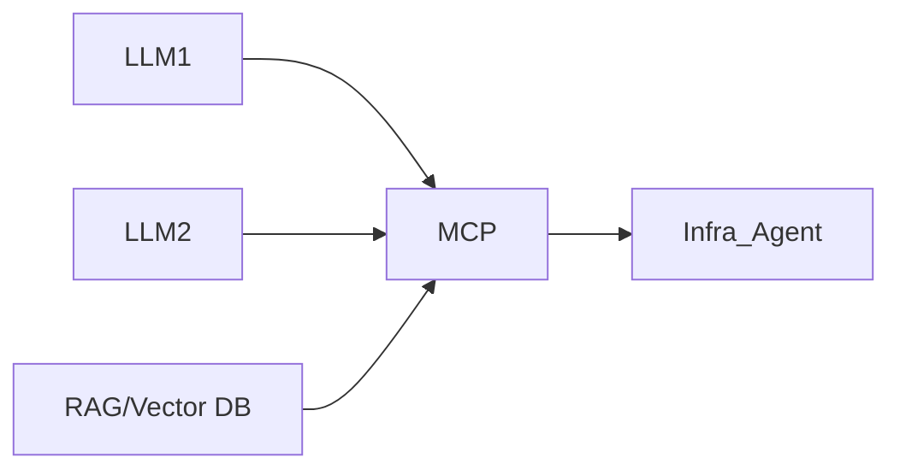

# AI Agent 구축방안 - Infra 및 클라우드 구성관리/Scaling

---

## Infra (Infrastructure)

- **성능데이터 수집, 분석, 진단, 이슈 및 개선안 보고, 성능개선, 속도개선**
- **가용성 확보** 위한 표준구성 진단 및 기획, 이중화, 소산 관리
- **유관 시스템 패치, 개선** 등 지침, **비정기 인프라 작업/지침**(K8s 등), 패치작업, 데이터 모니터링, WAS/DB/Tool 업그레이드, 솔루션(FTP, DRM, 검색엔진 등) 관리

---

## 핵심 질문

| 질문 | 내용 |
|------|------|
| 다양한 Cloud, 다양한 Devops? | |
| Cloud 만? (AZURE, AWS, K8S) | |
| Prompt 에 의한 유연한 동작 | |
| 인증/ 접근 권한? | |

---

## 시스템 아키텍처 (Mermaid)

```mermaid
flowchart TD
    subgraph Infra_Agent ["Infra Agent"]
        I1[1) 요청 기반 동작]
        I2[2) 결과 확인]
        I3[3) 모니터링 Agent 도구로 확인]
    end

    subgraph TOOL ["TOOL"]
        T1[서버 접속/실행]
        T2[GIT File 제어]
        T3[Devops 배포]
        T4[Service Monitoring Agent]
    end

    subgraph Cloud_Devops ["Cloud / Devops"]
        C1[AZURE MCP 등]
        C2[Devops MCP]
    end

    subgraph A_System ["A System"]
        A1[WEB Front]
        A2[Backend]
        A3[DB]
    end

    subgraph AI_Platform ["제조 AI Platform"]
        P1[LLM1]
        P2[LLM2]
        P3[RAG/Vector DB]
        P4[MCP]
    end

    %% 연결
    I1 --> T1
    I1 --> T2
    I1 --> T3
    I1 --> T4

    T1 -->|Prompt 에 의한 유연한 동작| C1
    T3 --> C2
    T4 --> A1
    C1 --> A1
    C2 --> A1

    A1 --> A2 --> A3

    %% 스타일
    style Infra_Agent fill:#f9fbe7,stroke:#827717,stroke-width:2px
    style TOOL fill:#fff3e0,stroke:#ef6c00
    style Cloud_Devops fill:#e1f5fe,stroke:#0277bd
    style A_System fill:#f3e5f5,stroke:#7b1fa2
    style AI_Platform fill:#e8f5e8,stroke:#2e7d32

    %% 주석
    click Infra_Agent "반복/대화 요청 기반 동작"
    click TOOL "A 시스템 성능 분석 해줘\nMEM/CPU 조정부 배포\nreplica 조정 후 배포"
```

---

## Infra Agent 기능 상세

| **기능** | **설명** |
|----------|----------|
| **1) 요청 기반 동작** | 사용자 또는 시스템 요청에 따라 실행 |
| **2) 결과 확인** | 실행 후 상태 및 성능 검증 |
| **3) 모니터링 Agent 도구로 확인** | Service Monitoring Agent 연동 |

---

## TOOL 구성

| **도구** | **기능** |
|----------|----------|
| 서버 접속/실행 | 리소스 점검, 로그 분석 |
| GIT File 제어 | 설정 파일 관리, 버전 제어 |
| Devops 배포 | 자동 배포 파이프라인 실행 |
| Service Monitoring Agent | 성능/가용성 실시간 모니터링 |

> **Cloud 만? (AZURE, AWS, K8S)**  
> **다양한 Cloud, 다양한 Devops?**

---

## 예시 요청 (Prompt 기반)

```text
- A 시스템 성능 분석 해줘
- MEM/CPU 조정부 배포
- replica 조정 후 배포
```

---

## 제조 AI Platform 구성



---

## 요약

| 항목 | 내용 |
|------|------|
| **목표** | 인프라 성능 진단 → 자동 조정 → 배포 및 Scaling |
| **핵심 에이전트** | Infra Agent (요청 기반 성능/구성 관리) |
| **입력** | 성능 데이터, 사용자 요청, 모니터링 결과 |
| **출력** | 리소스 조정, 배포 실행, 성능 보고 |
| **플랫폼** | 제조 AI Platform (LLM + RAG + MCP) |
| **지원 환경** | AZURE, AWS, K8S 등 멀티클라우드, DevOps |
| **고려사항** | 인증/권한, Prompt 기반 유연성, 반복/대화형 작업 |
