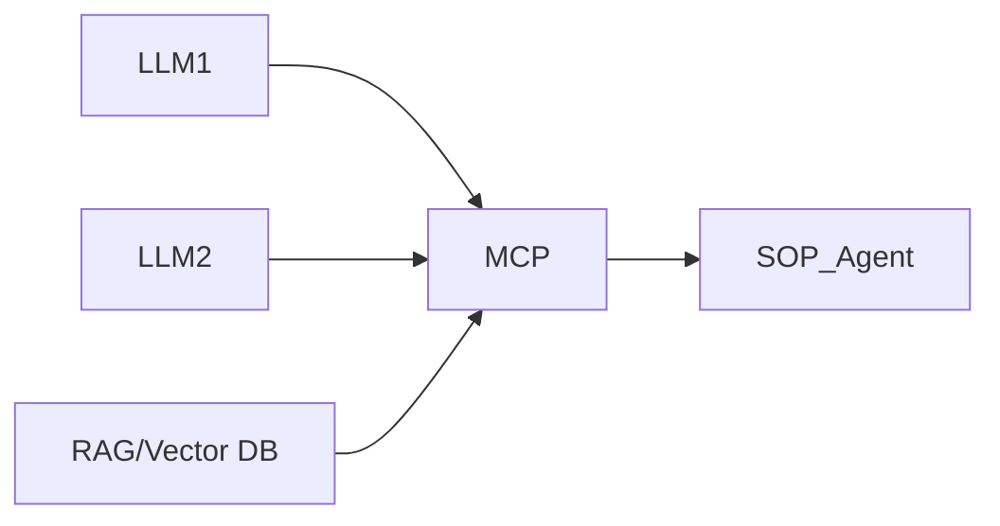

# AI Agent 구축방안 - SOP 및 장애 자동조치/가이드

---

## SOP (Standard Operating Procedure)

- 상황판단, 장애전파 및 조치, 장애원인분석, 사후 관리
- **법위가 너무 큰 것 아닌가?**

---

## 핵심 질문

| 질문 | 내용 |
|------|------|
| On-prem. (OS) / Cloud 다른 환경? | |
| 데이터 장애는? | |
| 요청 기반 동작 / 반복/대화? | |
| SOP Agent | 1) 모니터링 Agent 확인<br>2) 문제점 파악<br>→ 필요에 의한 Tool 추가 호출<br>3) Io-do 정리/조치 가이드<br>LLM 가이드, 기존 장애사례<br>4) 조치까지 실행?<br>5) 전파? |

---

## 시스템 아키텍처 (Mermaid)

```mermaid
flowchart TD
    subgraph SOP_Agent ["SOP Agent"]
        S1[1) 모니터링 Agent 확인]
        S2[2) 문제점 파악]
        S3[필요에 의한 Tool 추가 호출]
        S4[3) Io-do 정리/조치 가이드<br>LLM 가이드, 기존 장애사례]
        S5[4) 조치까지 실행?]
        S6[5) 전파?]
    end

    subgraph Service_Monitoring_Agent ["Service Monitoring Agent"]
        M1[URL 호출]
        M2[서버 접속/실행]
        M3[DB 접속]
        M4[전파]
    end

    subgraph A_System ["A System"]
        A1[WEB Front]
        A2[Backend]
        A3[DB]
    end

    subgraph Notification ["Mail/SMS/Slack 등"]
        N1[알림 전파]
    end

    subgraph AI_Platform ["제조 AI Platform"]
        P1[LLM1]
        P2[LLM2]
        P3[RAG/Vector DB]
        P4[MCP]
    end

    %% 연결
    S1 --> M1
    S1 --> M2
    S1 --> M3

    M1 --> A1
    M2 --> A2
    M3 --> A3

    S2 -->|Prompt에 의한 유연한 동작| S4
    S4 -->|대상자 META 정보| N1

    %% 스타일
    style SOP_Agent fill:#f0f4c3,stroke:#827717,stroke-width:2px
    style Service_Monitoring_Agent fill:#e1f5fe,stroke:#0277bd
    style A_System fill:#f3e5f5,stroke:#7b1fa2
    style Notification fill:#fff3e0,stroke:#ef6c00
    style AI_Platform fill:#e8f5e8,stroke:#2e7d32

    %% 클릭 주석
    click SOP_Agent "요청 기반 동작 / 반복/대화?"
    click M4 "데이터 장애는?"
```

---

## TOOL 구성 (Service Monitoring Agent)

| **도구** | **기능** |
|----------|----------|
| URL 호출 | Health Check, HTTP 상태 확인 |
| 서버 접속/실행 | 로그 확인, 프로세스 점검 |
| DB 접속 | 쿼리 실행, 데이터 존재 여부 |
| 전파 | **대상자 META 정보** 기반 알림 전송 |

> **Prompt에 의한 유연한 동작**  
> **대상자 META 정보** 기반 알림 전송 (Mail/SMS/Slack 등)

---

## 제조 AI Platform 구성



---

## 요약

| 항목 | 내용 |
|------|------|
| **목표** | 장애 상황판단 → 자동 조치 가이드 → 필요시 실행/전파 |
| **핵심 에이전트** | SOP Agent (모니터링 결과 분석 및 대응) |
| **입력** | Service Monitoring Agent 결과 |
| **출력** | 조치 가이드, 실행 명령, 알림 전파 |
| **플랫폼** | 제조 AI Platform (LLM + RAG + MCP) |
| **고려사항** | 온프레미스/클라우드 혼합, 데이터 장애, 반복/대화형 동작, 조치 실행 범위 |
