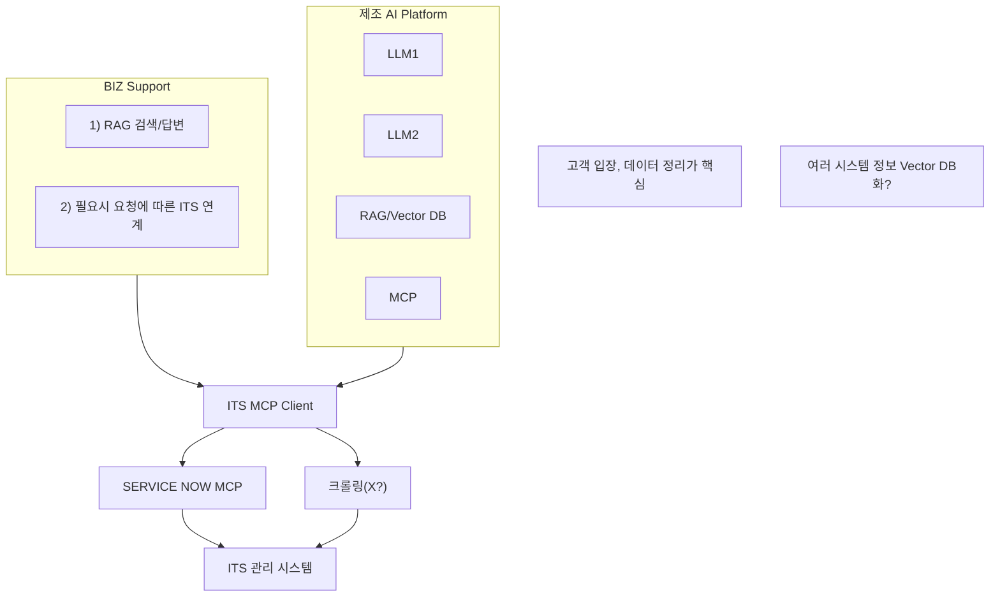

#### AI Agent 구축방안

**Biz.Support | 단순요청 Copilot**

- 기본적인 시스템 사용을 위한 지원 서비스(문의대응), 사용 미숙/잘못된 조작 등에 대해 IT 운영자 개입을 통한 해결/조치(설정변경)
- ISAC 접수 이벤트 대응, 문의응대
- 기본적인 시스템 사용을 위한 지원 서비스(계정발급, 권한 부여 등)
- 사용자의 Application 접속 환경 설정을 위한 지원(방화벽 오픈, 외부사이트 오픈, 필요 S/W 설치 등)

> "사용법 알려줘"  
> "어떻게 신청해?"  
> "A system 담당자는?"

***
- 고객 입장
- 데이터 정리가 핵심

***

#### 구조도

- BIZ Support
  1. RAG 검색/답변
  2. 필요시 요청에 따른 ITS 연계

- TOOL: ITS MCP Client

- ITS 관리 시스템:
    - SERVICE NOW MCP
    - 크롤링(X?)

- 제조 AI Platform:  
    - LLM1  
    - LLM2  
    - RAG/Vector DB  
    - MCP  

> 여러 시스템 정보 Vector DB 화?

***

### Mermaid 구조도 변환 예시



***

### 파일 저장 예시 (image_agent_design.md):

아래 내용을 image_agent_design.md로 저장하면 됩니다.

```markdown
# AI Agent 구축방안

## 이미지 기반 주요 텍스트

**Biz.Support | 단순요청 Copilot**

- 기본적인 시스템 사용을 위한 지원 서비스(문의대응), 사용 미숙/잘못된 조작 등에 대해 IT 운영자 개입을 통한 해결/조치(설정변경)
- ISAC 접수 이벤트 대응, 문의응대
- 기본적인 시스템 사용을 위한 지원 서비스(계정발급, 권한 부여 등)
- 사용자의 Application 접속 환경 설정 지원(방화벽 오픈, 외부사이트 오픈, 필요 S/W 설치 등)

> "사용법 알려줘"  
> "어떻게 신청해?"  
> "A system 담당자는?"

- 고객 입장
- 데이터 정리가 핵심

---

## 구조도 (Mermaid)

```
flowchart TB
    subgraph BizSupport["BIZ Support"]
        A1["1) RAG 검색/답변"]
        A2["2) 필요시 요청에 따른 ITS 연계"]
    end

    subgraph 제조AI["제조 AI Platform"]
        LLM1
        LLM2
        VECTOR_DB["RAG/Vector DB"]
        MCP
    end

    BizSupport --> TOOL["ITS MCP Client"]
    제조AI --> TOOL
    TOOL --> SERVICE_NOW["SERVICE NOW MCP"]
    TOOL --> CRAWLING["크롤링(X?)"]
    SERVICE_NOW --> ITS_MANAGE["ITS 관리 시스템"]
    CRAWLING --> ITS_MANAGE

    Note1["고객 입장, 데이터 정리가 핵심"]
    Note2["여러 시스템 정보 Vector DB화?"]
```
```