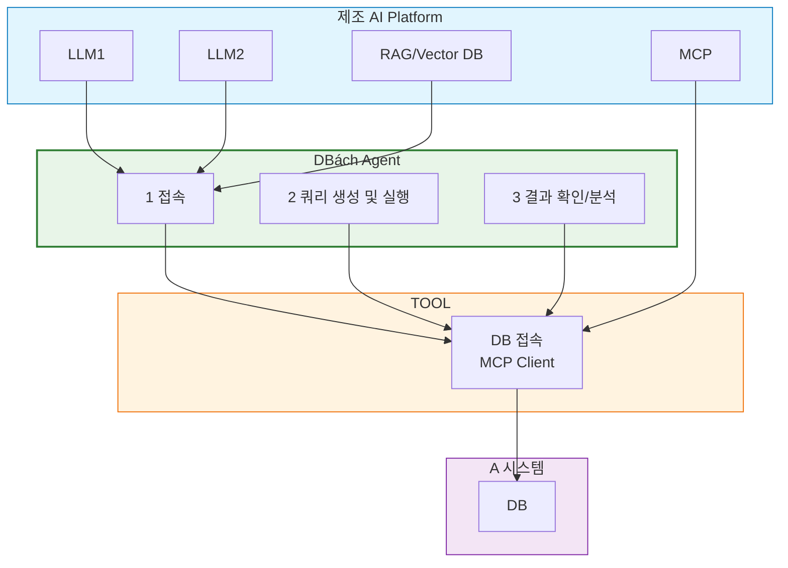
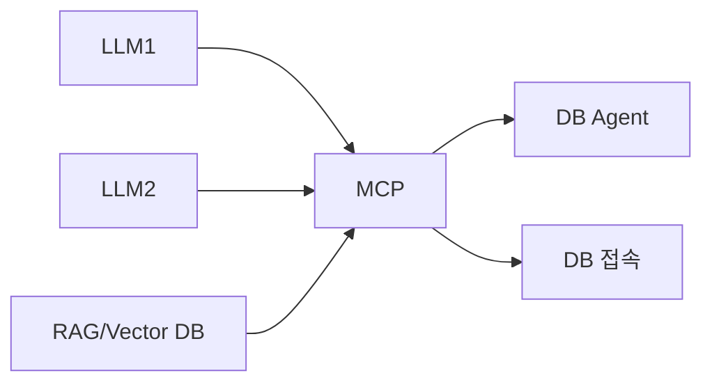

# AI Agent 구축방안 - DB 데이터 추출/Action

---

## DB (Database)

- 시스템 로직 또는 사용된 데이터에 대한 **정합성 여부를 검토**하거나 내용을 확인/분석하여 증대
- 업무 분석을 위한 필요 데이터를 **보정에 따라 추출** 및 분석하여 제공하는 서비스(비즈니스)
- 데이터를 **추가/수정/삭제**하거나, **쿼리 생성/실행**

---

## 핵심 질문

| 질문 | 내용 |
|------|------|
| 단순 쿼리만? | |
| 데이터 정합성 확인은? | |
| 데이터 오류까지 확인 | |
| 복잡한 report 쿼리까지? | |
| LLM이 시스템 DB 스키마를 이해하는 방법? | |

---

## 시스템 아키텍처 (Mermaid)



---

## DB Agent 기능 상세

| **기능** | **설명** |
|----------|----------|
| **1) 접속** | A 시스템 DB에 안전하게 접속 |
| **2) 쿼리 생성 및 실행** | 자연어 → SQL 자동 생성 및 실행 |
| **3) 결과 확인/분석** | 결과 검증, 정합성 판단, 보고서 생성 |

---

## TOOL 구성

| **도구** | **기능** |
|----------|----------|
| DB 접속 (MCP Client?) | 보안 인증 후 DB 연결 |

---

## 예시 요청 (자연어 기반)

```text
- A 시스템 접속해서 쿼리 날려줘
- A 시스템 주문 Data가 안보인데?
```

> **LLM이 시스템 DB 스키마를 이해하는 방법?**

---

## 제조 AI Platform 구성



> **시스템의 스키마 학습은? Vector DB 화?**

---

## 요약

| 항목 | 내용 |
|------|------|
| **목표** | 자연어 기반 DB 데이터 추출, 분석, 수정 |
| **핵심 에이전트** | DB Agent (접속 → 쿼리 → 분석) |
| **입력** | 사용자 자연어 요청 |
| **출력** | 쿼리 결과, 정합성 보고, 수정 실행 |
| **플랫폼** | 제조 AI Platform (LLM + RAG + MCP) |
| **고려사항** | 스키마 학습, 보안 접속, 복잡한 쿼리, 정합성 검증 |
