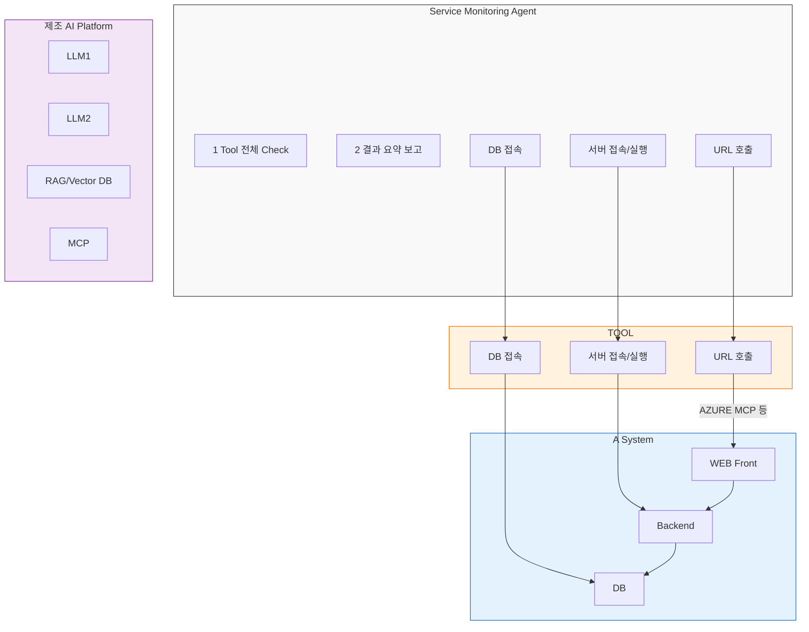
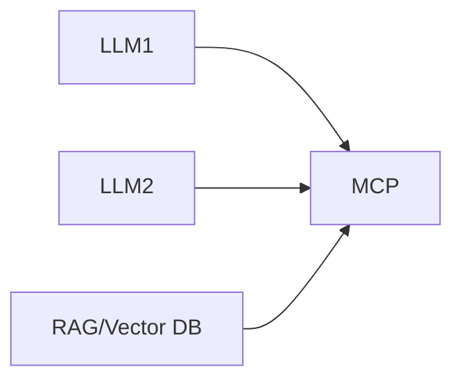

# Monitoring AI Agent 구축방안

## Service Monitoring

- **서비스의 Alive 확인**
- **수시/일/월별 실행 스케줄 Job 실행 Fail 여부 점검**  
  (Interface, Appl. 배치작업 등)
- **정기 IPM 서비스 점검/확인**, 필요 서비스 구동 확인

---

## App/DB 가용성 모니터링

### 핵심 질문

| 질문 | 내용 |
|------|------|
| 시스템 접속 정보 등 Meta 정보 관리는? | RAG? Prompt? DB로? |
| 사용자 인증/권한 관리는? | |
| On-prem. (OS) / Cloud 다른 환경? | |

---

## 시스템 아키텍처

---

## TOOL 점검 항목 상세

| **Agent** | **대상** | **도구** | **점검항목** | **점검사항** | **META정보 (운영 매뉴얼)** | **이슈/고려사항** |
|-----------|----------|----------|---------------|---------------|-------------------------------|---------------------|
| Service Monitoring | Appl. | URL 호출 | HTTP 코드 | Health Check URL 200 Check | URL | |
| | | Crawling(?) | API 호출 가능 확인 | 응답 Data, 속도 METRIC 정보로 사전 점검 | URL, 결과 값, 정상 속도 | 스크립트 만들기 |
| | | 서버 접속 (File Read) | Log 확인, onprem | 최근 로그 확인 | 서버정보, OS, 로그 파일 위치 | |
| | | MCP 프리미엄 | Log 확인, 프리미엄 | 최근 로그 확인 | API 구분 값 | |
| | | OS 접속/커맨드 실행 | Process 확인 | 서버 접속 후 프로세스 기동 확인 | 서버정보, OS, 프로세스 명 | 다양한 OS, onprem/cloud |
| | | 실습 확인 | CPU, MEM, IO 등 Check | | 서버정보, OS | |
| | | 명령 확인 | Disk 용량 확인 | | 서버정보, OS, PVC 등 | |
| | Cloud 제공 MCP | | | | | |
| | DB | DB접속 및 쿼리 | DB 접속 여부 | 접속여부, Select Data | DB 정보 | 다양한 DB 지원 |
| | | | 특정 데이터 존재 (비물리 쿼리) | 특정 데이터 존재 여부 | 쿼리 | |
| | | | DB LOCK 존재 | | | |
| | IF | TCP/URL 호출 | IF 대상 통신 여부 | 정상 접속 되는 지리 IP로 구분 사전점검? | target 정보, 응답코드 | 백화백 OPEN (외부점검) |
| | | 접속 및 쿼리 | IF data 확인 | 최근 Data 조회, IF log Data 조회 등? | 쿼리, 예상 결과 값 | |

---

## 제조 AI Platform

> **사람 Platform이 모두 지원가능한가? 없다면?**

---

## 요약

| 항목 | 내용 |
|------|------|
| **목표** | 서비스 및 App/DB 가용성 자동 모니터링 |
| **대상** | URL, 서버, DB, IF, OS, Cloud MCP 등 |
| **방법** | Tool 기반 자동 점검 (URL 호출, 접속, 쿼리, 로그 등) |
| **플랫폼** | 제조 AI Platform (LLM, RAG, MCP 연동) |
| **고려사항** | 온프레미스/클라우드 혼합 환경, 인증/권한, Meta 정보 관리 |

